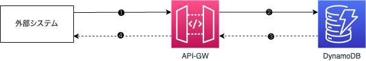

# ApiGatewayDynamoDBConstruct

## Overview

`ApiGatewayDynamoDBConstruct`は、API Gateway と DynamoDB を接続するための AWS CDK コンストラクトです。このコンストラクトは、DynamoDB テーブルと API Gateway を作成し、API Gateway のリソースに対して DynamoDB の操作を行うメソッドを設定します。

## Construct Props

`IApiGatewayDynamodbProps`は、`ApiGatewayDynamoDBConstruct`で使用するプロパティのインターフェースで、以下のプロパティを含めます。

| プロパティ名     | 　型                                                                                                                | 必須 | 説明                                  |
| ---------------- | ------------------------------------------------------------------------------------------------------------------- | ---- | ------------------------------------- |
| dynamoTableProps | [dynamodb.TableProps](https://docs.aws.amazon.com/cdk/api/v2/docs/aws-cdk-lib.aws_dynamodb.TableProps.html)         | Yes  | DynamoDB テーブルを設定するプロパティ |
| apiGatewayProps  | [apigateway.RestApiProps](https://docs.aws.amazon.com/cdk/api/v2/docs/aws-cdk-lib.aws_apigateway.RestApiProps.html) | Yes  | API Gateway を設定するプロパティ      |

## Construct Method

| メソッド名                                       | 説明                                                              |
| ------------------------------------------------ | ----------------------------------------------------------------- |
| setupMethod(resourcePath,operation,methodConfig) | apigateway に、指定されたリソースパスに紐付けるメソッドを作成する |

#### setupMethod(resourcePath,operation,methodConfig)

```typescript
  public setupMethod(resourcePath: string, operation: OperationType, methodConfig: IMethodConfig): void
```

_Parameters_

- **resourcePath** `string` -リソースパス （もし存在しなければ、メソッド内で新規作成される）
- **operation** `OperationType` -テーブルに対する操作（ "create" | "read" | "list" | "update" | "delete"）
- **methodConfig** [IMethodConfig](#interface-imethodconfig) -メソッド設定

このメソッドは、指定されたリソースパスに対して API Gateway のメソッドを設定します。リソースパスが存在しない場合は、新規に作成されます。指定された操作タイプに基づいて、DynamoDB テーブルに対する適切なアクションが設定されます。メソッド設定は、リクエストテンプレートやレスポンス設定などの詳細な設定を含みます。
※本メソッドを実行しないでデプロイすると、apigateway と dynamodb を作成するだけです。

---

##　構成図


#### 処理フロー

1. **外部クライアントからのリクエスト送信**

   - クライアント（モバイルアプリやウェブアプリなど）から、API Gateway に予約要求リクエストを送信。
   - DB に対する照会、登録、更新、削除などの操作が含まれる。

2. **API Gateway によるリクエスト整形**

   - API Gateway のマッピングテンプレートを使用し、リクエスト内容を整形。
   - DynamoDB に対応したメソッド（PutItem, GetItem, UpdateItem, DeleteItem）を呼び出し、リクエスト内容を DynamoDB に送信。

3. **DynamoDB からのレスポンス取得**

   - DynamoDB のメソッドの結果が API Gateway に返される。

4. **API Gateway によるレスポンスの整形と返却**
   - API Gateway は、DynamoDB の結果を整形し、外部クライアントにレスポンスとして送信。
     <br>

#### API Gateway から DynamoDB へ直接アクセスする方法

- **メリット**

  - ✅ **シンプルな構成**: Lambda を経由せず、直接 API Gateway から DynamoDB へアクセス。
  - ✅ **低コスト**: Lambda のオーバーヘッドがなく、コストを抑えつつ同じ機能を実現。
  - ✅ **迅速な API 構築**: Lambda 実装が不要なため、より速く API を構築可能。

- **デメリット**
  - ❌ **複雑なロジックを組み込めない**: マッピングテンプレートでは複雑なビジネスロジックの処理が難しい。

<br>

#### ConstructHub のライブラリとの比較

- ConstructHub には、同じ構成を簡単に実現できるライブラリが提供されている（[@aws-solutions-constructs/aws-apigateway-dynamodb](https://construct-hub-testing.dev-tools.aws.dev/packages/@aws-solutions-constructs/aws-apigateway-dynamodb/v/2.64.0?lang=typescript)）。
- しかし、ConstructHub のライブラリでは API Gateway のリソースを自由に定義・追加することができない制約がある。
- そのため、この制約を克服するために本テンプレートが作成された。
  <br>

---

## Construct の利用手順

#### Quick Start

1. `git clone [本リポジトリ]`コマンドを実行して、本テンプレートをダウンロードする
2. `cd apigateway-dynamodb-cdk`コマンドを実行して、CDK ディレクトリに移動する
3. `npm ci`コマンドを実行して、必要なモジュール、ライブラリーをインストールする
4. `cdk synth`コマンドを実行して、CloudFormation テンプレートを生成する
5. `cdk deploy ApigatewayDynamodbCdkStack`コマンドを実行して、スタックをデプロイする

#### 要件に合わせて修正

1. スタッククラス`ApigatewayDynamodbCdkStack`の.ts ファイルを開く

2. DynamoDB テーブルの設定修正

```typescript
// dynamodbの作成
const dynamodbProps: dynamodb.TableProps = {
  tableName: "reservation-table",
  partitionKey: {
    name: "reservationId",
    type: dynamodb.AttributeType.STRING,
  },
};
```

必要であれば、テーブルの他の諸設定を編集する（GSI、LSI、課金モードなど）
<br>

3. API Gateway の設定修正

```typescript
// API Gatewayの作成
const apigatewayProps: apigateway.RestApiProps = {
  restApiName: "reservation-api-gateway",
  deployOptions: {
    stageName: "dev",
  },
};
```

必要であれば、apigateway の他の諸設定を編集する（エンドポイントタイプ、ドメインネイムなど）
<br>

4. Construct を作成する

```typescript
// ApiGatewayDynamoDBConstructをインスタンス化
const construct = new ApiGatewayDynamoDBConstruct(this, "ApiGatewayDynamoDB", {
  dynamoTableProps: dynamodbProps,
  apiGatewayProps: apigatewayProps,
});
```

<br>

5. setupMethod()を呼び出し、リソースとメソッドを作成する（必要に応じて、複数のメソッドを追加可能）
   以下の設定を引数として、setipMethod()に渡すため、呼び出す前に生成する必要があります。
   - 統合リクエスト
     API Gateway がバックエンド（Lambda、HTTP、AWS Service など）へリクエストをどのように送信するかを定義します。
     本 CDK では、VTL マッピングテンプレートを使用して DynamoDB へリクエストを送信します。
     （VTL マッピングテンプレートの書き方は[AWS 開発者ガイド](https://docs.aws.amazon.com/ja_jp/apigateway/latest/developerguide/api-gateway-mapping-template-reference.html?icmpid=docs_apigateway_console)を参照してください。）
   - 統合レスポンス
     DynamoDB からのレスポンスを API Gateway でどのように処理するかを定義します。
   - メソッドリクエスト
     クライアントからのリクエストをどのように受け入れるかを定義します。モデル（スキーマ定義）の追加や認証方法を設定可能です。
     （スキーマ定義の書き方は[REST API のデータモデル](https://docs.aws.amazon.com/ja_jp/apigateway/latest/developerguide/models-mappings-models.html)を参照してください。）
   - メソッドレスポンス
     API Gateway からクライアントに返すレスポンスの定義します。モデル（スキーマ定義）の追加は可能です。
     ※上記 4 つの機能を理解するために、[イラストで理解する API Gateway](https://zenn.dev/fdnsy/articles/86897abce0bbf5)の記事を参考にしてください。
     <br>
     例：登録操作を追加する

```typescript
// 登録処理のリクエストテンプレート
// requestIdをreservationIdに設定
const createRequestTemplate = `{
            "TableName": "reservation-table",
            "Item": {
              "reservationId": {
                "S": "$context.requestId"
              },
              "executeTimestamp": {
                "S": $input.json('$.executeTimestamp')
              }
            }
          }`;

// 登録処理の統合レスポンス設定
// reservationIdを返却するように設定
const createIntegrationResponse = [
  {
    statusCode: "200",
    responseTemplates: {
      "application/json": '{"reservationId": "$context.requestId"}',
    },
  },
  {
    statusCode: "400",
    selectionPattern: "4\\d{2}", // 4xxエラーをキャッチ
    responseTemplates: {
      "application/json": '{"message": "Bad Request"}',
    },
  },
];

// 登録処理のリクエストボディモデルを追加
const createRequestBodyModel = new apigateway.Model(
  this,
  "CreateRequestBodyModel",
  {
    modelName: "CreateRequestBodyModel",
    description: "Request body for create reservation",
    restApi: construct.api,
    contentType: "application/json",
    schema: {
      type: apigateway.JsonSchemaType.OBJECT,
      properties: {
        executeTimestamp: {
          type: apigateway.JsonSchemaType.STRING,
        },
      },
      required: ["executeTimestamp"],
    },
  }
);

// 登録処理のレスポンスボディモデルを追加
const createResponseBodyModel = new apigateway.Model(
  this,
  "CreateResponseBodyModel",
  {
    modelName: "CreateResponseBodyModel",
    description: "Response body for create reservation",
    restApi: construct.api,
    contentType: "application/json",
    schema: {
      type: apigateway.JsonSchemaType.OBJECT,
      properties: {
        reservationId: {
          type: apigateway.JsonSchemaType.STRING,
        },
      },
      required: ["reservationId"],
    },
  }
);

// 登録処理のメソッドレスポンス設定
const createMethodResponse = [
  {
    statusCode: "200",
    responseModels: {
      "application/json": createResponseBodyModel,
    },
  },
  {
    statusCode: "400",
    responseModels: {
      "application/json": apigateway.Model.EMPTY_MODEL, // 4xxエラーレスポンスは空モデル（自由に設定可能）
    },
  },
];

// apigatewayにメソッドを追加
construct.setupMethod("v1/dummy/reservations", "create", {
  integrationConfig: {
    requestTemplate: createRequestTemplate,
    integrationResponse: createIntegrationResponse,
  },
  methodOptions: {
    requestModels: {
      "application/json": createRequestBodyModel,
    },
    methodResponses: createMethodResponse,
  },
});
```

#### リソース削除

1. `cdk destroy ApigatewayDynamodbCdkStack`コマンドを実行して、スタックを削除する
2. AWS コンソール上に dynamodb を手動で削除する
3. 削除が完了したら、CloudFormation スタックが削除されていることを確認する

---

# interface IMethodConfig

## Properties

| プロパティ名      | 型                                                                                                         | 必須 | 説明                                                       |
| ----------------- | ---------------------------------------------------------------------------------------------------------- | ---- | ---------------------------------------------------------- |
| integrationConfig | [IIntegrationConfig](#interface-IIntegrationConfig)                                                        | Yes  | イングレーション設定（統合リクエストと統合レスポンス）     |
| methodOptions 　  | [MethodOptions](https://docs.aws.amazon.com/cdk/api/v2/docs/aws-cdk-lib.aws_apigateway.MethodOptions.html) | No   | メソッド設定（メソッドリクエストとメソッドレスポンスなど） |

リソースメソッド設定用のインターフェース

---

# interface IIntegrationConfig

## Properties

| プロパティ名        | 型                                                                                                                     | 必須 | 説明                         |
| ------------------- | ---------------------------------------------------------------------------------------------------------------------- | ---- | ---------------------------- |
| requestTemplate     | 　　　 string                                                                                                          | Yes  | リクエストテンプレート       |
| integrationResponse | [integrationResponse](https://docs.aws.amazon.com/cdk/api/v2/docs/aws-cdk-lib.aws_apigateway.IntegrationResponse.html) | Yes  | インテグレーションレスポンス |

統合メソッド設定用のインターフェース
