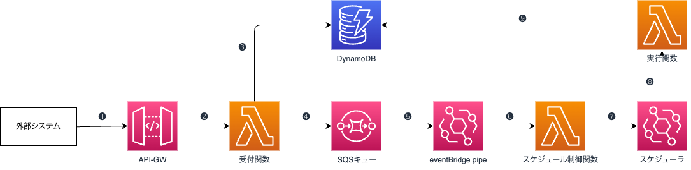
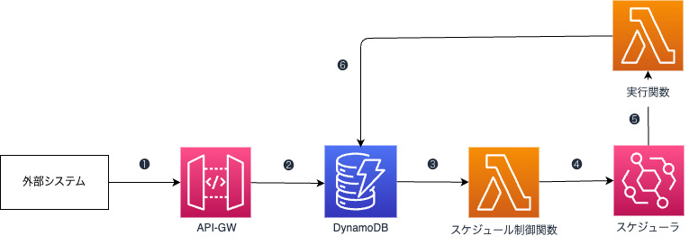

# AWS構成図
---
##　Chargementに使用する構成図（簡略）

- **充電計画予約　処理の流れ**
　❶外部クライアントからのリクエストを受け取る
　❷〜❸リクエストされた内容を受付関数に渡して、内容をDBに登録する
　❹予約内容をSQSへ渡す（疎結合）
　❺eventBridge pipeに渡して、内容を整形する
　❻〜❼内容をスケジュール制御関数に渡して、スケジューラを作成する
　❽予約した時間に、スケジューラが実装され、必要な情報を実行関数に渡す
　❾実行関数の処理が終わり、DBに登録する
　　
---

##　Event-driven型予約システム　簡潔版構成図

- **簡潔版　処理の流れ**
　❶外部クライアントからのリクエストを受け取る
　❷API-GWのマップングテンプレートを使い、リクエストされた内容を整形して、DBに登録する
　❸DynamoDBストリームに更新をかけてイベントを発火して、スケジュール制御関数を呼び出す
　❹予約時間の元に、スケジューラーを作成する
　❺〜❻予約された時間に、実行関数の処理が実行され、DBに登録する

※再利用しやすくため、一番シンプルの構成となっている

