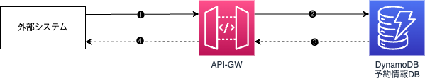

# 目的

- **技術者のスキル向上と学習の促進**
  - CDK テンプレートを提供することで、開発者が学習しやすくし、スキル向上を目指す。
- **既存プロジェクトの効率化と再利用性の向上**

  - 現在のシステム構成をテンプレート化し、将来的なプロジェクトにおける効率的かつ再利用可能なインフラ構築を実現。

- **標準化の推進**
  - 統一されたインフラ構成をテンプレートとして提供し、運用や保守の簡素化を図り、インフラの標準化を推進。

---

# 対象者

- **CDK 初心者**

  - CDK に不慣れな開発者でも、テンプレートを利用して簡単にインフラを構築できるようサポート。

- **短期間でプロジェクトを立ち上げたい人**
  - テンプレートを活用して、効率的にシステムを迅速に立ち上げたい人。

---

# テンプレート概要

- **イベント駆動型の予約システムの構築**

  - ユーザーがオンラインでリソースの予約を行うシステムを提供。

- **ユースケース例**

  - 充電器での充電予約サービス（特定の時間で充電を予約）。
  - IoT を利用したスマート家電で、遠隔からの操作予約。
  - 会議室やホテルの予約機能に組み込む時間指定の情報配信サービス。

- **システム特性**

  - イベントトリガーを活用し、スケーラブルで高可用性を実現する予約管理システム。

- **アーキテクチャ**
  - 流用しやすく、できる限り簡潔なシステム構成を採用。

---

# AWS 構成図

##　件名に使用する構成（簡略）


### 充電計画予約の処理フロー

1. **リクエスト受付**
   - 外部クライアントからのリクエストを受け取る。
2. **リクエスト処理**

   - 受付関数にリクエスト内容を渡し、内容を DB に登録。

3. **SQS への連携**

   - 登録した予約内容を SQS に送信（疎結合構成）。

4. **EventBridge Pipe での整形**

   - EventBridge Pipe に渡して、リクエスト内容を整形。

5. **スケジュール作成**

   - スケジュール制御関数に内容を渡し、スケジューラを作成。

6. **予約実行**

   - 予約時間にスケジューラが動作し、必要な情報を実行関数に渡す。

7. **DB への更新**
   - 実行関数が処理を完了し、結果を DB に登録

---

##　 event-driven 型予約システム 簡潔版構成


### 簡潔版の処理フロー

1. **リクエスト受付**

   - 外部クライアントからのリクエストを受け取る。

2. **API Gateway でのリクエスト整形**

   - API Gateway のマッピングテンプレートを使い、リクエスト内容を整形し、DB に登録。

3. **DynamoDB ストリームをトリガー**

   - DynamoDB ストリームを通じて、更新イベントを発火させ、スケジュール制御関数を呼び出す。

4. **スケジュール作成**

   - 予約時間を元にスケジューラーを作成。

5. **予約時間での実行**
   - 予約された時間に、実行関数が処理を実行し、結果を DB に登録。

※本構成は再利用性を高めるため、シンプルな設計となっています

---

## 予約要求受付（❶〜❷）

###　構成図


#### 予約要求受付の処理フロー

1. **外部クライアントからのリクエスト送信**

   - クライアント（モバイルアプリやウェブアプリなど）から、API Gateway に予約要求リクエストを送信。
   - 予約の照会、登録、更新、削除などの操作が含まれる。

2. **API Gateway によるリクエスト整形**

   - API Gateway のマッピングテンプレートを使用し、リクエスト内容を整形。
   - DynamoDB に対応したメソッド（PutItem, GetItem, UpdateItem, DeleteItem）を呼び出し、リクエスト内容を DynamoDB に送信。

3. **DynamoDB からのレスポンス取得**

   - DynamoDB のメソッドの結果が API Gateway に返される。

4. **API Gateway によるレスポンスの整形と返却**
   - API Gateway は、DynamoDB の結果を整形し、外部クライアントにレスポンスとして送信。
     <br>

#### API Gateway から DynamoDB へ直接アクセスする方法

- **メリット**

  - ✅ **シンプルな構成**: Lambda を経由せず、直接 API Gateway から DynamoDB へアクセス。
  - ✅ **低コスト**: Lambda のオーバーヘッドがなく、コストを抑えつつ同じ機能を実現。
  - ✅ **迅速な API 構築**: Lambda 実装が不要なため、より速く API を構築可能。

- **デメリット**
  - ❌ **複雑なロジックを組み込めない**: マッピングテンプレートでは複雑なビジネスロジックの処理が難しい。

<br>

#### ConstructHub のライブラリとの比較

- ConstructHub には、同じ構成を簡単に実現できるライブラリが提供されている（[@aws-solutions-constructs/aws-apigateway-dynamodb](https://construct-hub-testing.dev-tools.aws.dev/packages/@aws-solutions-constructs/aws-apigateway-dynamodb/v/2.64.0?lang=typescript)）。
- しかし、ConstructHub のライブラリでは API Gateway のリソースを自由に定義・追加することができない制約がある。
- そのため、この制約を克服するために本テンプレートが作成された。
  <br>

### テンプレートの利用手順

#### CDK プロジェクトを新規作成

1. `git clone https://github.com/xxxx.git`コマンドを実行して、本テンプレートをダウンロードする
2. `cd api-gateway-dynamodb-cdk`コマンドを実行して、CDK ディレクトリに移動する
3. `npm ci`コマンドを実行して、必要なモジュール、ライブラリーをインストールする

//todo
cdk synth depolyを先に説明する
細かいところは後で補足


#### 要件に合わせてソースコードを修正

1. スタッククラス`ApiGatewayToDynamodbCdkStack`の.ts ファイルを開く

2. DynamoDB テーブルの設定を編集する（必要はない手順を飛ばして OK）

   1. テーブルを新規作成し、パーティションキーとソートキーを編集する

   ```typescript　
      // dynamodb tableを作成
      const table = new dynamodb.Table(this, props.dynamoTableProps.tableName, {
        partitionKey: {
          name: props.dynamoTableProps.partitionKey.name,
          type: props.dynamoTableProps.partitionKey.type,
        },
        tableName: props.dynamoTableProps.tableName,
      });
   ```

   例：pk = reservationId, sk = reservationId_executeTimestamp の場合

   ```typescript 　
   // dynamodb table を作成
   const table = new dynamodb.Table(this, props.dynamoTableProps.tableName, {
     partitionKey: {
       name: props.dynamoTableProps.partitionKey.name,
       type: props.dynamoTableProps.partitionKey.type,
     },
     sortKey: {
       name: props.dynamoTableProps.sortKey.name,
       type: props.dynamoTableProps.sortKey.type,
     },
     tableName: props.dynamoTableProps.tableName,
   });
   ```

   2. 必要であれば、テーブルの他の諸設定を編集する（GSI、LSI、課金モードなど）
      CDK 開発ドキュメント：[AWS CDK interface TableProps](https://docs.aws.amazon.com/cdk/api/v2/docs/aws-cdk-lib.aws_dynamodb.TableProps.html)
      <br>

3. API Gateway の設定を編集する（必要はない手順を飛ばして OK）

   1. API Gateway を新規作成し、基本設定を編集する

   ```typescript
   // API Gatewayの作成
   const api = new apigateway.RestApi(this, props.apiGatewayProps.restApiName, {
     restApiName: props.apiGatewayProps.restApiName,
     deployOptions: {
       // ステージ名を指定
       stageName: "dev",
     },
   });
   ```

   例：ステージ名は`poc`、説明は`予約システムAPI`の場合

   ```typescript
   // API Gatewayの作成
   const api = new apigateway.RestApi(this, props.apiGatewayProps.restApiName, {
     restApiName: props.apiGatewayProps.restApiName,
     description: "予約システムAPI",
     deployOptions: {
       // ステージ名を指定
       stageName: "poc",
     },
   });
   ```

   2. リソースを追加（必要に応じて、複数のリソースを追加可能）

   ```typescript
   // ルートリソースの作成
   const resource = api.root.addResource(props.resourceName);

   // サブリソースの作成
   const subResource = resource.addResource(
     props.subResourceName || "{reservationId}"
   );
   ```

   例：ルートリソースは`reservation`、サブリソースは`{reservationId}`の場合

   ```typescript
   // ルートリソースの作成
   const resource = api.root.addResource("reservation");

   // サブリソースの作成
   const subResource = resource.addResource("{reservationId}");
   ```

   3. リソースにメソッドを追加（デフォルトはルートリソース配下に post と get を追加、サブリソース配下に get、put、delete を追加）

   ```typescript
   // POSTメソッドの追加
   const postIntegration = new apigateway.AwsIntegration({
     service: "dynamodb",
     action: "PutItem",
     options: {
       credentialsRole: apiGatewayRole,
       requestTemplates: {
         "application/json": `{
             "TableName": "${table.tableName}",
             "Item": {
               "reservationId": {
                 "S": "$context.requestId"
               },
               "executeTimestamp": {
                 "S": $input.json('$.executeTimestamp')
               }
             }
           }`,
       },
       integrationResponses: [
         {
           statusCode: "200",
           responseTemplates: {
             "application/json": '{"message": "Item added successfully"}',
           },
         },
         {
           statusCode: "400",
           selectionPattern: "4\\d{2}", // 4xxエラーをキャッチ
           responseTemplates: {
             "application/json": '{"message": "Bad Request"}',
           },
         },
       ],
     },
   });

   resource.addMethod("POST", postIntegration, {
     methodResponses: [
       {
         statusCode: "200",
         responseModels: {
           "application/json": apigateway.Model.EMPTY_MODEL,
         },
       },
       {
         statusCode: "400",
         responseModels: {
           "application/json": apigateway.Model.EMPTY_MODEL,
         },
       },
     ],
   });
   ```

4. 既存リソースの情報の元で、`./bin/wg-ec2-start-cdk.ts`ファイルを編集する
   (ソースコードはハードコーディングされているが、実際に合わせて修正が必要)
   **※各リソースの情報は、AWS マネジメントコンソールから取得する**
   1. 既存 VPC の情報を編集する
   ```json
   {
     "vpc": {
       "vpcId": "vpc-xxxx", // 既存VPCのID
       "vpcName": "xxxxx" // 既存VPCの名前
     }
   }
   ```
   2. 既存サブネットの情報を編集する
   ```json
   {
     "subnet": {
       "subnetId": "subnet-xxxx", // 既存サブネットのID
       "subnetName": "xxxxx", // 既存サブネットの名前
       "availabilityZone": "ap-northeast-1xxxx", // 既存サブネットのAZ
       "routeTableId": "rtb-xxxxx" // 既存サブネットのルートテーブルID
     }
   }
   ```
   3. 既存セキュリティグループの情報を編集する
   ```json
   {
     "securityGroup": {
       "securityGroupId": "sg-xxxxx", // 既存セキュリティグループのID
       "securityGroupName": "xxxxx" // 既存セキュリティグループの名前
     }
   }
   ```
   4. 既存 IAM ロールの情報を編集する
   ```json
   {
     "iamRole": {
       "roleArn": "arn:aws:iam::xxxxx:role/xxxxx", // 既存IAMロールのARN
       "roleName": "xxxxx" // 既存IAMロールの名前
     }
   }
   ```
   5. スタック名を編集する(同じスタック名でデプロイするとエラーが発生する)
   ```typescript
   new Ec2CdkStack(app, "stackName-xxxxx", {
     env: myEnv,
     users: users,
     emailPrefixes: emailPrefixes,
     existingResources: existingResources,
   });
   ```
5. 編集したファイル(.json,.ts)を保存する

#### デプロイ

1.  `cdk synth`コマンドを実行して、CloudFormation テンプレートを生成する
2.  `cdk deploy [スタック名]`コマンドを実行して、スタックをデプロイする
3.  デプロイが完了したら、SSM からアクセス可能な EC2 インスタンスが起動されていることを確認する

#### リソース削除

1. `cdk destroy [スタック名]`コマンドを実行して、スタックを削除する
2. 削除が完了したら、CloudFormation スタックが削除されていることを確認する

---

# Welcome to your CDK TypeScript project

You should explore the contents of this project. It demonstrates a CDK app with an instance of a stack (`WgEc2StartCdkStack`)

The `cdk.json` file tells the CDK Toolkit how to execute your app.

## Useful commands

- `npm run build` compile typescript to js
- `npm run watch` watch for changes and compile
- `npm run test` perform the jest unit tests
- `cdk deploy` deploy this stack to your default AWS account/region
- `cdk diff` compare deployed stack with current state
- `cdk synth` emits the synthesized CloudFormation template
